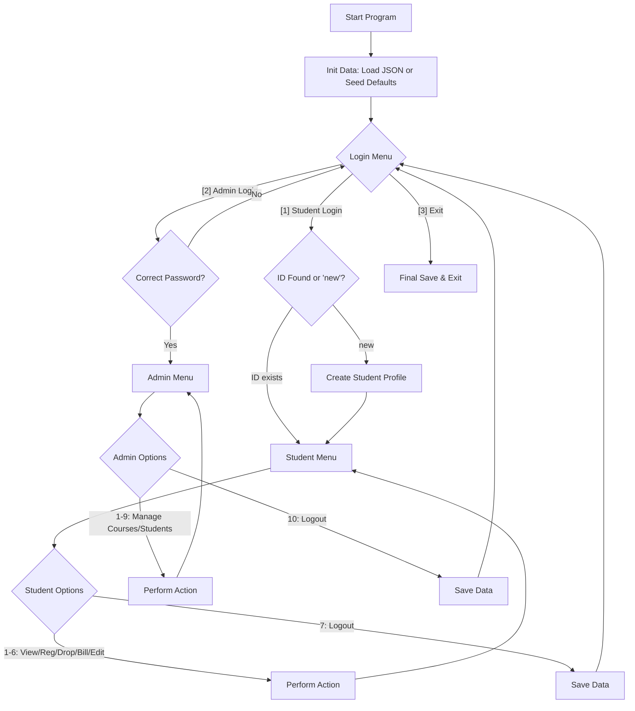

# unknownapp
This is an unknown application written in Java

---- For Submission (you must fill in the information below) ----
### Use Case Diagram
use-case-diagram.png
### Flowchart of the main workflow

### Prompts

- "To help you complete Task 1, I need to see the core logic of the application."
- "Analyze the provided Main.java and EnrollmentSystem.java to identify the core business logic."
- "Select the 'Billing Summary' use case and reengineer the calculateTuition method from Java into an equivalent Python script."
- "Ensure the improve Python version uses a class structure and handles missing student/course data similarly to the original Java logic."
